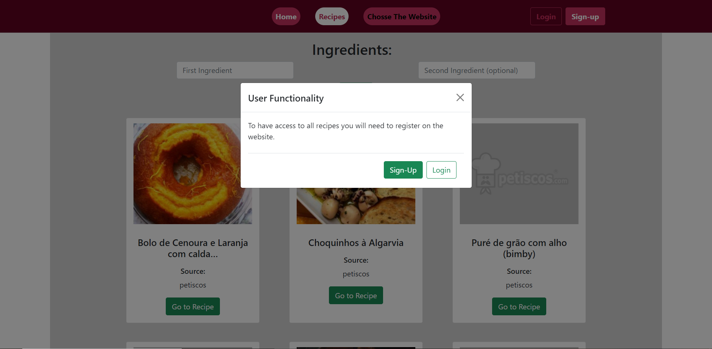

# Quick_Recipe_API


Este projeto consiste numa Web API com sistema de login e na API no back-end com o propósito de uma pesquisa mais rápida de receitas de diversos sites.
O Url da Web API se for inicializada na própria máquina será: localhost:8000 

# Built with

## Frontend
- [Bootstrap 5.1.3](https://getbootstrap.com/)
- Vanilla JS

## Backend
- [Node.js](https://nodejs.org/en/)
- [Express.js](https://expressjs.com/)
- [jsonwebtoken](https://www.npmjs.com/package/jsonwebtoken)
- [bcrypt](https://www.npmjs.com/package/bcrypt)
- [nedb](https://www.npmjs.com/package/nedb)

## Pre-requisitos
- Instalar [Node.js](https://nodejs.org/en/)

# Como começar
- clonar o repositório

- Instalar dependências
```
npm install
```
- Correr o Projeto
```
npm run start
```
- Abrir no browser
```
localhost:8000
```
# Screenshots
##Webpage


##Recipes Page - Sem conta aparece mensagem a informar que precisa de logar para ter disponível todas as receitas, neste momento só consegue ver 15 e utilizar o filtro dos ingrediente nessas 


##Choose Website Page- Após login, tanto tem acesso a todas as receitas e filtrar as mesmas por 1 ou 2 ingredientes. Como terá acesso há página de escolher o website, este mostrará todas as receitas retiradas do respetivo site

